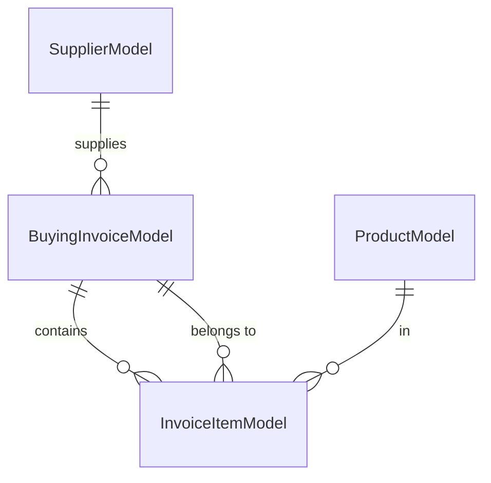

# Data Model: Buying Invoice Feature

**Date**: 2026-07-20 | **Spec**: [spec.md](spec.md) | **Research**: [research.md](research.md)

## Entity Relationship Diagram



## Entities

### 1. BuyingInvoiceModel (NEW)
**File**: `lib/core/models/buying_invoice_model.dart`

| Field | Type | Constraints | Description |
|-------|------|-------------|-------------|
| id | int | @Id(), auto-generated | Primary key |
| date | DateTime | required | Invoice date |
| discount | double? | optional, default 0 | Discount amount |
| paidAmount | double | default 0 | Amount paid to supplier |
| supplier | ToOne<SupplierModel> | required | Supplier relation |
| items | ToMany<InvoiceItemModel> | cascade delete | Invoice line items |

**Computed Properties** (not persisted):
- `subtotal`: sum of items' lineTotal
- `total`: subtotal - discount
- `remainingAmount`: total - paidAmount

**Relationships**:
- `supplier`: ToOne<SupplierModel> (required, one-to-one conceptually)
- `items`: ToMany<InvoiceItemModel> (one-to-many, cascade delete on invoice delete)

---

### 2. InvoiceItemModel (EXISTING - UPDATED)
**File**: `lib/core/models/invoice_item_model.dart`

| Field | Type | Constraints | Description |
|-------|------|-------------|-------------|
| id | int | @Id(), auto-generated | Primary key |
| product | ToOne<ProductModel> | required | Product relation |
| quantity | int | default 0 | Quantity purchased |
| unitPrice | double | required | Buying price per unit |
| lineTotal | double | computed | quantity × unitPrice |
| invoice | ToOne<BuyingInvoiceModel> | optional | Backlink to buying invoice |

**Note**: Also used by SellingInvoiceModel (separate ToOne if needed, or separate item model). For buying invoices, the `invoice` backlink points to BuyingInvoiceModel.

**Methods**:
- `copyWith({quantity, unitPrice, lineTotal, product})`: Returns new instance with updated values

---

### 3. SupplierModel (EXISTING)
**File**: `lib/core/models/supplier_model.dart`

| Field | Type | Constraints | Description |
|-------|------|-------------|-------------|
| id | int | @Id(), auto-generated | Primary key |
| name | String | required | Supplier name |
| storeName | String | required | Store/business name |
| storeAdd | String? | optional | Store address |
| phoneNum | String | required | Phone number |

---

### 4. ProductModel (EXISTING)
**File**: `lib/core/models/product_model.dart`

| Field | Type | Constraints | Description |
|-------|------|-------------|-------------|
| id | int | @Id(), auto-generated | Primary key |
| name | String | required | Product name |
| imgPath | String? | optional | Image path |
| quantity | int | required, ≥0 | Current stock |
| buyingPrice | double | required | Cost price |
| sellingPrice | double | required | Sale price |
| wholesalePrice | double | required | Wholesale price |
| barcode | String? | optional, unique | Barcode |

**Behavior on Buying Invoice Confirm**:
- `quantity` increases by InvoiceItemModel.quantity
- `buyingPrice` may update if price change confirmed (FR-006)

---

## State Transitions

### BuyingInvoiceModel Lifecycle
```
[Draft] → [Validating] → [Confirmed] → [Persisted]
                ↓
           [Error] → [Draft]
```

- **Draft**: User building invoice, items added/removed, supplier selected
- **Validating**: confirmInvoice() called, checking supplier + items qty > 0
- **Confirmed**: Business logic executed (inventory↑, safe↓, audit entry)
- **Persisted**: Saved to ObjectBox, form reset

### InvoiceItemModel in Buying Invoice
```
[Added, qty=0] → [Qty > 0] → [Confirmed with invoice]
       ↓              ↓
[Removed]      [Qty=0 → Removed]
```

---

## Validation Rules

| Rule | Trigger | Error Message |
|------|---------|---------------|
| Supplier required | confirmInvoice() | "يرجى اختيار مورد" |
| At least one item with qty > 0 | confirmInvoice() | "يرجى إضافة منتج واحد على الأقل بكمية أكبر من صفر" |
| Safe balance sufficient | confirmInvoice() | "رصيد الخزنة غير كافٍ" |
| Product stock available | Not applicable for buying (inventory increases) | N/A |

---

## ObjectBox Indexes (Performance)

| Entity | Field | Index Type |
|--------|-------|------------|
| BuyingInvoiceModel | date | @Index() |
| BuyingInvoiceModel | supplier.id | @Index() |
| InvoiceItemModel | product.id | @Index() |
| SupplierModel | name | @Index() |
| ProductModel | name | @Index() |
| ProductModel | barcode | @Index(unique: true) |

---

## Generated Files (After build_runner)

- `lib/objectbox.g.dart` - Box accessors, queries, relations
- `lib/objectbox-model.json` - Schema for migrations

---

## Migration Notes

**From existing state**:
1. InvoiceItemModel already exists (shared with selling)
2. Add `ToOne<BuyingInvoiceModel> invoice` to InvoiceItemModel
3. Create BuyingInvoiceModel with ToMany<InvoiceItemModel> items
4. Run `dart run build_runner build --delete-conflicting-outputs`

**No breaking changes** to existing SellingInvoiceModel or SellInvoiceItemModel.